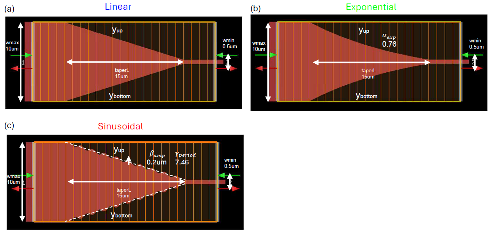
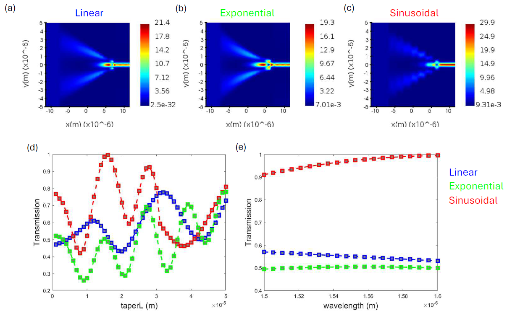

# Efficient Silicon-on-Insulator (SOI) Waveguide Tapers
## Abstract

Designing efficient waveguide tapers is critical in silicon photonics. We introduce two taper designs—an **adiabatic exponential** taper and a **non-adiabatic sinusoidal** taper—aimed at achieving high transmission between a **10-µm-wide** input silicon waveguide and a **0.5-µm-wide** output silicon waveguide at **λ = 1.55 µm**. Taper parameters were optimized via parameter sweeps and global optimization using the **Lumerical Eigenmode Expansion (EME)** solver. The **sinusoidal** taper outperforms both linear and exponential designs, especially at shorter lengths, and achieves **>90% transmission** across the **1.5–1.6 µm** wavelength range.

---

## Overview
This repository accompanies the report **“Efficient silicon-on-insulator waveguide taper design.”**  
It provides formulas, example scripts, and instructions to reproduce simulations and optimization results for three taper families:

- **Linear (adiabatic)**
- **Exponential (adiabatic)**
- **Sinusoidal (non-adiabatic)**
We use **Eigenmode Expansion (EME)** to sweep design parameters and apply **Particle Swarm Optimization (PSO)** to maximize the **intensity transmission coefficient** between the input and output SOI waveguides.

---

## Key Results
- **Platform:** SOI (Si core, SiO₂ cladding), thickness **220 nm**  
- **Transition:** **10 µm (input) → 0.5 µm (output)**  
- **Representative length:** **15 µm**  
- **Exponential taper:** best around **α ≈ 0.76**, ~**0.50** transmission at **1.55 µm**  
- **Sinusoidal taper:** PSO-optimized **β ≈ 0.2 µm**, **γ ≈ 7.5**, ~**0.97** transmission at **1.55 µm**; **> 0.9** across **1.5–1.6 µm**  
- Across **10–30 µm** lengths, the sinusoidal taper yields the highest transmission; very long adiabatic tapers also become low-loss.

---

## Method Summary

- **Platform**  
  Silicon-on-Insulator (Si core, SiO₂ cladding). Input waveguide **10 µm** wide to output **0.5 µm** wide; thickness ~**220 nm**; telecom band centered near **1.55 µm**.

- **Taper Families**
  - **Linear (adiabatic):** Width varies linearly with propagation distance.
  - **Exponential (adiabatic):** Width follows an exponential profile parameterized by **α**, smoothing mode evolution near the narrow end.
  - **Sinusoidal (non-adiabatic):** Width is sinusoidally modulated by **period** and **amplitude** to enable compact, high-throughput transitions.

- **Simulation & Metric**  
  Lumerical **Eigenmode Expansion (EME)** with fundamental-mode excitation; transmission extracted from the S-matrix (power transmission).

- **Parameter Studies & Optimization**
  - **Sinusoidal:** Period sweep, amplitude sweep, and an optimization run (“optimization curve”).
  - **Exponential:** **α**-parameter sweep.
  - **Cross-family comparisons:** Transmission vs **taper length** (e.g., 1–50 µm) and vs **wavelength** (1.5–1.6 µm).

- **Data Organization**  
  Plain-text, two-column files `(x, Transmission)` in `results/`, plus `show_swwp_results.mat` consolidating parsed outputs.

- **Key Takeaway**  
  Adiabatic tapers (linear/exponential) generally improve with increased length, while the **sinusoidal** geometry achieves **high transmission at shorter lengths**, making it attractive when footprint is constrained.

---

## Figures

- **Taper geometries**  
  Linear, exponential, and sinusoidal taper shapes (input 10 µm → output 0.5 µm, thickness 220 nm, nominal length 15 µm).
  
  

- **Parameter sweeps & optimization**  
  Sinusoidal: period and amplitude sweeps + PSO optimization; Exponential: α sweep.
  
  

- **Field profiles & comparisons**  
  Field intensity inside each taper; transmission vs **taper length** (1–50 µm) and vs **wavelength** (1.5–1.6 µm).
  
  

---

## Data

All raw numerical results exported from Lumerical EME are stored as plain-text, two-column files:

- **Sinusoidal sweeps / optimization**
  - `eme_taper_period_sweep_p1.txt` — number-of-periods sweep
  - `eme_taper_amp_sweep_16.txt` — amplitude sweep (period fixed)
  - `eme_taper_sinusoidal_optimization_curve.txt` — optimization history

- **Exponential sweep**
  - `eme_taper_exponential_n_exp_sweep.txt` — α-parameter sweep

- **Best-result comparisons (three taper families)**
  - `eme_taper_*_best_result_group_span2.txt` — transmission vs taper length
  - `eme_taper_*_best_result_wavenelght_1.5to1.6_sweep.txt` — transmission vs wavelength

A consolidated MATLAB file, **`show_sweep_results.mat`**, aggregates/organizes these text files for quick loading.

---

## Reproducing the plots

Requirements:
- **MATLAB** (R2023b+ recommended)
- The `results/` text files present as listed above

---

## License

All source code in this repository is licensed under the MIT License.

